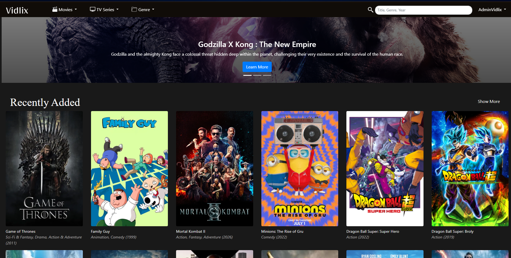
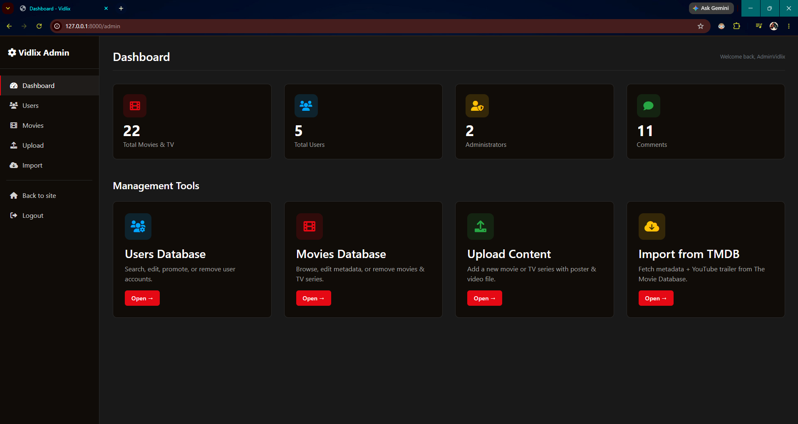
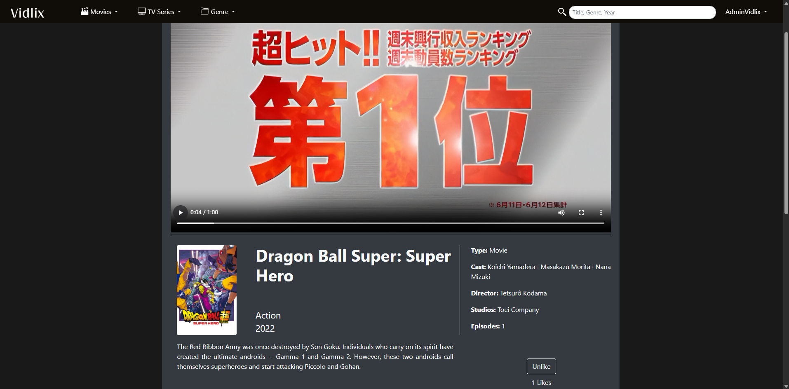
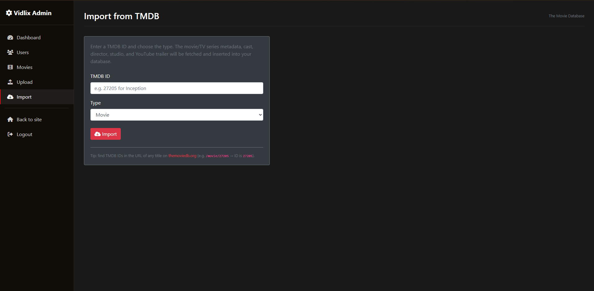

# Vidlix — Netflix Clone (Fullstack Laravel)

A full-featured streaming platform clone built with Laravel 10, featuring user authentication, movie/TV browsing, comments, likes, admin dashboard, and TMDB integration for importing movie metadata with YouTube trailer embeds.

## Screenshots

| Home Page                     | Admin Dashboard                         |
| ----------------------------- | --------------------------------------- |
|  |  |

| Movie Player (YouTube Trailer)    | TMDB Import                       |
| --------------------------------- | --------------------------------- |
|  |  |

## Tech Stack

- **Backend**: Laravel 10 (PHP 8.1)
- **Database**: MySQL
- **Frontend**: Blade templates + Bootstrap 4/5 + Vite
- **Authentication**: Laravel UI + Sanctum
- **External APIs**: TMDB (The Movie Database)

## Features

### User Features

- Register/login with Laravel UI
- Browse movies & TV series by trending, popular, liked, or genre (Action, Adventure, Comedy, Romance, Horror, Mystery, Drama)
- Search movies by title or genre with pagination
- Watch YouTube trailers embedded from TMDB
- Leave comments on movies
- Like/unlike movies (anti-duplicate with pivot table)
- Edit profile (name, email)

### Admin Features

- Dedicated admin dashboard with quick stats (movies, users, admins, comments)
- Manage users (view, edit, delete, toggle admin status)
- Manage movies (view, edit, delete)
- Upload new movies/TV series with poster + video file
- Import movies from TMDB (fetches metadata, cast, director, studio, YouTube trailer)
- Moderate comments (delete)

## Installation

### Prerequisites

- PHP >= 8.1
- Composer
- Node.js + npm
- MySQL
- TMDB API key (free from https://www.themoviedb.org/settings/api)

### Steps

1. Clone the repository

    ```bash
    git clone https://github.com/hanifinf/Netflix-clone.git
    cd Netflix-clone
    ```

2. Install PHP dependencies

    ```bash
    composer install
    ```

3. Install JS dependencies + build assets

    ```bash
    npm install
    npm run dev
    ```

4. Copy `.env.example` to `.env` and configure

    ```bash
    cp .env.example .env
    php artisan key:generate
    ```

5. Configure database in `.env`

    ```env
    DB_CONNECTION=mysql
    DB_HOST=127.0.0.1
    DB_PORT=3306
    DB_DATABASE=your_database_name
    DB_USERNAME=your_username
    DB_PASSWORD=your_password
    ```

6. Add TMDB API key to `.env`

    ```env
    TMDB_API_KEY=your_tmdb_api_key_here
    ```

7. Run migrations + seeders

    ```bash
    php artisan migrate
    php artisan db:seed
    ```

8. Create storage symlink

    ```bash
    php artisan storage:link
    ```

9. Start the dev server

    ```bash
    php artisan serve
    ```

10. Visit `http://localhost:8000`

### Default Admin Account

- Email: `adminvidlix@gmail.com`
- Password: `admin12345`

## Database Schema

### Users

- id, name, email, password, admin (boolean), timestamps

### Movies

- id, title, genre, year, description, poster (URL), video_path (URL or `youtube:{key}`), type (Movie/TV-Series), trending, popular, likes, cast, director, studio, episode, timestamps

### Comments

- id, movie_id (FK), user_id (FK), content, timestamps

### movie_user (pivot for likes)

- movie_id (FK), user_id (FK), timestamps
- Unique constraint prevents duplicate likes

## Key Technical Highlights

- **Responsive grid layout** using Bootstrap `row-cols-*` utilities (2→3→4→6 columns at different breakpoints)
- **Storage facade** for file uploads (posters/videos) with legacy path support via custom accessors
- **TMDB integration** via Laravel HTTP client (fetches metadata + credits + trailer in single API call)
- **YouTube trailer embed** detection via custom accessor (`youtube:{key}` → iframe)
- **Anti-duplicate likes** using pivot table with unique constraint + `toggle()` method
- **Admin middleware** with session-free authorization (middleware-only gating, no per-method checks)
- **Eloquent accessors** for dynamic URL generation (handles legacy paths, storage paths, external URLs, YouTube keys)
- **Idempotent seeders** using `firstOrCreate` so `db:seed` is safe to re-run

## Project Structure

```
app/
├── Http/
│   ├── Controllers/
│   │   ├── AdminController.php              # Dashboard with stats
│   │   ├── AdminMovieImportController.php   # TMDB import
│   │   ├── MovieController.php              # Browse, play, search, like, comment
│   │   ├── MovieDataController.php          # Admin movie CRUD
│   │   ├── UserDataController.php           # Admin user CRUD
│   │   └── ...
│   └── Middleware/
│       └── AdminMiddleware.php              # Admin-only route protection
├── Models/
│   ├── User.php
│   ├── Movie.php                            # Custom accessors for poster_url, video_url
│   └── Comment.php
└── Services/
    └── TmdbImporter.php                     # TMDB API integration

resources/views/
├── layouts/
│   ├── nav.blade.php                        # Main site layout
│   └── admin.blade.php                      # Admin dashboard layout (sidebar)
├── admin/
│   ├── dashboard.blade.php                  # Stats + management tiles
│   └── import.blade.php                     # TMDB import form
└── ...

database/
├── migrations/                              # 10 migrations for users, movies, comments, etc.
└── seeders/
    ├── UsersTableSeeder.php                 # Default admin account
    └── MoviesTableSeeder.php                # Sample movie (Minions)
```

## Security Features

- CSRF protection on all forms
- Password hashing (bcrypt)
- Admin middleware on all admin routes
- File upload validation (type, size limits)
- SQL injection prevention (Eloquent ORM)
- XSS prevention (Blade auto-escaping)

## Lessons Learned

- Responsive design with Bootstrap grid system
- RESTful route design and controller organization
- Eloquent relationships (hasMany, belongsToMany, belongsTo)
- File storage with Laravel Storage facade
- External API integration (TMDB)
- Middleware for authorization
- Database migrations and seeders

## Future Improvements

- [ ] Add API endpoints for external consumption (React/Vue frontend)
- [ ] Implement user roles (viewer, critic, moderator)
- [ ] Add movie recommendations based on genre/likes
- [ ] Implement search with Elasticsearch
- [ ] Implement movie ratings (1-5 stars)
- [ ] Add user watchlist feature
- [ ] Add pagination to all listing pages
- [ ] Deploy to production (Railway/Heroku/VPS)

## License

This project is open-sourced under the MIT license.

## Author

**Your Name**

- GitHub: [@HanifiNF](https://github.com/HanifiNF)
